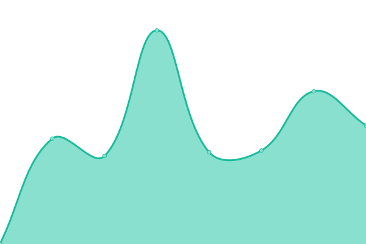
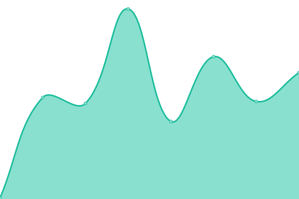
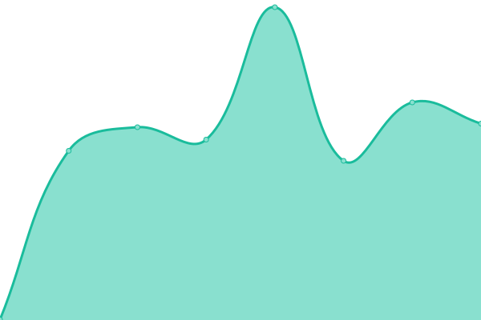
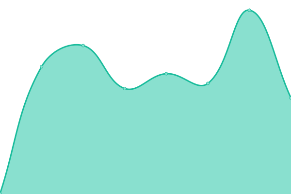
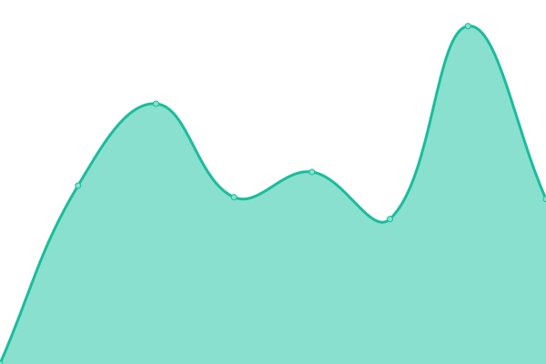
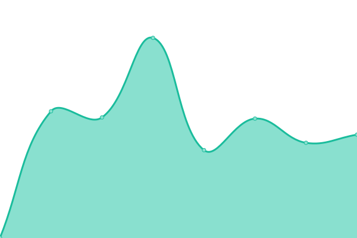
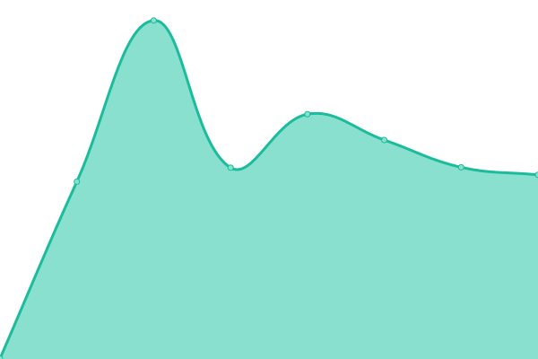

# [📈 Live Status](https://IDR.github.io/upptime): <!--live status--> **🟩 All systems operational**

This repository contains the open-source uptime monitor and status page for [Image Data Resource](https://idr.openmicroscopy.org), powered by [Upptime](https://github.com/upptime/upptime).

With [Upptime](https://upptime.js.org), you can get your own unlimited and free uptime monitor and status page, powered entirely by a GitHub repository. We use [Issues](https://github.com/IDR/upptime/issues) as incident reports, [Actions](https://github.com/IDR/upptime/actions) as uptime monitors, and [Pages](https://IDR.github.io/upptime) for the status page.

<!--start: status pages-->
<!-- This summary is generated by Upptime (https://github.com/upptime/upptime) -->
<!-- Do not edit this manually, your changes will be overwritten -->
<!-- prettier-ignore -->
| URL | Status | History | Response Time | Uptime |
| --- | ------ | ------- | ------------- | ------ |
|  [IDR](https://idr.openmicroscopy.org) | 🟩 Up | [idr.yml](https://github.com/IDR/upptime/commits/HEAD/history/idr.yml) | 

 733ms
     
 | 

<a href="https://IDR.github.io/upptime/history/idr">95.28%</a>
    

|  [ITR](https://itr.openmicroscopy.org) | 🟩 Up | [itr.yml](https://github.com/IDR/upptime/commits/HEAD/history/itr.yml) | 

 826ms
     
 | 

<a href="https://IDR.github.io/upptime/history/itr">100.00%</a>
    

|  [IDR API](https://idr.openmicroscopy.org/about/api.html) | 🟩 Up | [idr-api.yml](https://github.com/IDR/upptime/commits/HEAD/history/idr-api.yml) | 

 227ms
     
 | 

<a href="https://IDR.github.io/upptime/history/idr-api">100.00%</a>
    

|  [IDR submission](https://idr.openmicroscopy.org/about/submission.html) | 🟩 Up | [idr-submission.yml](https://github.com/IDR/upptime/commits/HEAD/history/idr-submission.yml) | 

 114ms
     
 | 

<a href="https://IDR.github.io/upptime/history/idr-submission">100.00%</a>
    

|  [IDR Analysis](https://idr-analysis.openmicroscopy.org) | 🟩 Up | [idr-analysis.yml](https://github.com/IDR/upptime/commits/HEAD/history/idr-analysis.yml) | 

 700ms
     
 | 

<a href="https://IDR.github.io/upptime/history/idr-analysis">100.00%</a>
    

|  [IDR Jupyter](https://idr.openmicroscopy.org/jupyter) | 🟩 Up | [idr-jupyter.yml](https://github.com/IDR/upptime/commits/HEAD/history/idr-jupyter.yml) | 

 227ms
     
 | 

<a href="https://IDR.github.io/upptime/history/idr-jupyter">100.00%</a>
    

|  [IDR (well 590686)](https://idr.openmicroscopy.org/webclient/?show=well-590686) | 🟩 Up | [idr-well-590686.yml](https://github.com/IDR/upptime/commits/HEAD/history/idr-well-590686.yml) | 

 755ms
     
 | 

<a href="https://IDR.github.io/upptime/history/idr-well-590686">98.96%</a>
    

|  [IDR (well 119093)](https://idr.openmicroscopy.org/webclient/?show=well-119093) | 🟩 Up | [idr-well-119093.yml](https://github.com/IDR/upptime/commits/HEAD/history/idr-well-119093.yml) | 

 633ms
     
 | 

<a href="https://IDR.github.io/upptime/history/idr-well-119093">98.88%</a>
    

|  [IDR (well 4852)](https://idr.openmicroscopy.org/webclient/?show=well-4852) | 🟩 Up | [idr-well-4852.yml](https://github.com/IDR/upptime/commits/HEAD/history/idr-well-4852.yml) | 

 591ms
     
 | 

<a href="https://IDR.github.io/upptime/history/idr-well-4852">98.91%</a>
    

|  [IDR (well 469267)](https://idr.openmicroscopy.org/webclient/?show=well-469267) | 🟩 Up | [idr-well-469267.yml](https://github.com/IDR/upptime/commits/HEAD/history/idr-well-469267.yml) | 

 569ms
     
 | 

<a href="https://IDR.github.io/upptime/history/idr-well-469267">98.94%</a>
    

|  [IDR (well 547609)](https://idr.openmicroscopy.org/webclient/?show=well-547609) | 🟩 Up | [idr-well-547609.yml](https://github.com/IDR/upptime/commits/HEAD/history/idr-well-547609.yml) | 

 558ms
     
 | 

<a href="https://IDR.github.io/upptime/history/idr-well-547609">98.81%</a>
    

|  [IDR (image 820684)](https://idr.openmicroscopy.org/webclient/?show=image-820684) | 🟩 Up | [idr-image-820684.yml](https://github.com/IDR/upptime/commits/HEAD/history/idr-image-820684.yml) | 

 692ms
     
 | 

<a href="https://IDR.github.io/upptime/history/idr-image-820684">98.85%</a>
    

|  [IDR (well 37472)](https://idr.openmicroscopy.org/webclient/?show=well-37472) | 🟩 Up | [idr-well-37472.yml](https://github.com/IDR/upptime/commits/HEAD/history/idr-well-37472.yml) | 

 604ms
     
 | 

<a href="https://IDR.github.io/upptime/history/idr-well-37472">93.94%</a>
    

|  [IDR (well 45407)](https://idr.openmicroscopy.org/webclient/?show=well-45407) | 🟩 Up | [idr-well-45407.yml](https://github.com/IDR/upptime/commits/HEAD/history/idr-well-45407.yml) | 

 573ms
     
 | 

<a href="https://IDR.github.io/upptime/history/idr-well-45407">93.98%</a>
    

|  [IDR (image 648950)](https://idr.openmicroscopy.org/webclient/?show=image-648950) | 🟩 Up | [idr-image-648950.yml](https://github.com/IDR/upptime/commits/HEAD/history/idr-image-648950.yml) | 

 681ms
     
 | 

<a href="https://IDR.github.io/upptime/history/idr-image-648950">94.19%</a>
    

|  [IDR (image 3063667)](https://idr.openmicroscopy.org/webclient/?show=image-3063667) | 🟩 Up | [idr-image-3063667.yml](https://github.com/IDR/upptime/commits/HEAD/history/idr-image-3063667.yml) | 

 699ms
     
 | 

<a href="https://IDR.github.io/upptime/history/idr-image-3063667">93.64%</a>
    

|  [IDR (image 2849866)](https://idr.openmicroscopy.org/webclient/?show=image-2849866) | 🟩 Up | [idr-image-2849866.yml](https://github.com/IDR/upptime/commits/HEAD/history/idr-image-2849866.yml) | 

 703ms
     
 | 

<a href="https://IDR.github.io/upptime/history/idr-image-2849866">93.38%</a>
    

|  [IDR (image 1821818)](https://idr.openmicroscopy.org/webclient/?show=image-1821818) | 🟩 Up | [idr-image-1821818.yml](https://github.com/IDR/upptime/commits/HEAD/history/idr-image-1821818.yml) | 

 798ms
     
 | 

<a href="https://IDR.github.io/upptime/history/idr-image-1821818">93.37%</a>
    

|  [IDR (image 1636543)](https://idr.openmicroscopy.org/webclient/?show=image-1636543) | 🟩 Up | [idr-image-1636543.yml](https://github.com/IDR/upptime/commits/HEAD/history/idr-image-1636543.yml) | 

 793ms
     
 | 

<a href="https://IDR.github.io/upptime/history/idr-image-1636543">93.24%</a>
    

|  [IDR (well 1056578)](https://idr.openmicroscopy.org/webclient/?show=well-1056578) | 🟩 Up | [idr-well-1056578.yml](https://github.com/IDR/upptime/commits/HEAD/history/idr-well-1056578.yml) | 

 590ms
     
 | 

<a href="https://IDR.github.io/upptime/history/idr-well-1056578">93.56%</a>
    

|  [IDR (well 1029401)](https://idr.openmicroscopy.org/webclient/?show=well-1029401) | 🟩 Up | [idr-well-1029401.yml](https://github.com/IDR/upptime/commits/HEAD/history/idr-well-1029401.yml) | 

 602ms
     
 | 

<a href="https://IDR.github.io/upptime/history/idr-well-1029401">93.85%</a>
    

|  [IDR (well 1046336)](https://idr.openmicroscopy.org/webclient/?show=well-1046336) | 🟩 Up | [idr-well-1046336.yml](https://github.com/IDR/upptime/commits/HEAD/history/idr-well-1046336.yml) | 

 611ms
     
 | 

<a href="https://IDR.github.io/upptime/history/idr-well-1046336">94.13%</a>
    

|  [IDR (dataset 369)](https://idr.openmicroscopy.org/webclient/?show=dataset-369) | 🟩 Up | [idr-dataset-369.yml](https://github.com/IDR/upptime/commits/HEAD/history/idr-dataset-369.yml) | 

 531ms
     
 | 

<a href="https://IDR.github.io/upptime/history/idr-dataset-369">94.31%</a>
    

|  [IDR (well 1024671)](https://idr.openmicroscopy.org/webclient/?show=well-1024671) | 🟩 Up | [idr-well-1024671.yml](https://github.com/IDR/upptime/commits/HEAD/history/idr-well-1024671.yml) | 

 577ms
     
 | 

<a href="https://IDR.github.io/upptime/history/idr-well-1024671">94.36%</a>
    

|  [IDR (well 1030579)](https://idr.openmicroscopy.org/webclient/?show=well-1030579) | 🟩 Up | [idr-well-1030579.yml](https://github.com/IDR/upptime/commits/HEAD/history/idr-well-1030579.yml) | 

 607ms
     
 | 

<a href="https://IDR.github.io/upptime/history/idr-well-1030579">94.40%</a>
    

|  [IDR (dataset 51)](https://idr.openmicroscopy.org/webclient/?show=dataset-51) | 🟩 Up | [idr-dataset-51.yml](https://github.com/IDR/upptime/commits/HEAD/history/idr-dataset-51.yml) | 

 523ms
     
 | 

<a href="https://IDR.github.io/upptime/history/idr-dataset-51">94.21%</a>
    

|  [IDR (dataset 61)](https://idr.openmicroscopy.org/webclient/?show=dataset-61) | 🟩 Up | [idr-dataset-61.yml](https://github.com/IDR/upptime/commits/HEAD/history/idr-dataset-61.yml) | 

 508ms
     
 | 

<a href="https://IDR.github.io/upptime/history/idr-dataset-61">94.49%</a>
    

|  [IDR 2858266](https://idr.openmicroscopy.org/webclient/?show=image-2858266) | 🟩 Up | [idr-2858266.yml](https://github.com/IDR/upptime/commits/HEAD/history/idr-2858266.yml) | 

 547ms
     
 | 

<a href="https://IDR.github.io/upptime/history/idr-2858266">91.37%</a>
    

|  [IDR (image 2895051)](https://idr.openmicroscopy.org/webclient/?show=image-2895051) | 🟩 Up | [idr-image-2895051.yml](https://github.com/IDR/upptime/commits/HEAD/history/idr-image-2895051.yml) | 

 673ms
     
 | 

<a href="https://IDR.github.io/upptime/history/idr-image-2895051">96.05%</a>
    

|  [IDR (image 3125776)](https://idr.openmicroscopy.org/webclient/?show=image-3125776) | 🟩 Up | [idr-image-3125776.yml](https://github.com/IDR/upptime/commits/HEAD/history/idr-image-3125776.yml) | 

 560ms
     
 | 

<a href="https://IDR.github.io/upptime/history/idr-image-3125776">95.98%</a>
    

|  [IDR (phenotype CMPO_0000393)](https://idr.openmicroscopy.org/mapr/phenotype/?value=CMPO_0000393) | 🟩 Up | [idr-phenotype-cmpo-0000393.yml](https://github.com/IDR/upptime/commits/HEAD/history/idr-phenotype-cmpo-0000393.yml) | 

 527ms
     
 | 

<a href="https://IDR.github.io/upptime/history/idr-phenotype-cmpo-0000393">96.34%</a>
    

|  [IDR (phenotype CMPO_0000118)](https://idr.openmicroscopy.org/mapr/phenotype/?value=CMPO_0000118) | 🟩 Up | [idr-phenotype-cmpo-0000118.yml](https://github.com/IDR/upptime/commits/HEAD/history/idr-phenotype-cmpo-0000118.yml) | 

 467ms
     
 | 

<a href="https://IDR.github.io/upptime/history/idr-phenotype-cmpo-0000118">96.38%</a>
    

|  [IDR (phenotype CMPO_0000140)](https://idr.openmicroscopy.org/mapr/phenotype/?value=CMPO_0000140) | 🟩 Up | [idr-phenotype-cmpo-0000140.yml](https://github.com/IDR/upptime/commits/HEAD/history/idr-phenotype-cmpo-0000140.yml) | 

 388ms
     
 | 

<a href="https://IDR.github.io/upptime/history/idr-phenotype-cmpo-0000140">91.56%</a>
    

|  [IDR (gene SGOL1)](https://idr.openmicroscopy.org/mapr/gene/?value=SGOL1) | 🟩 Up | [idr-gene-sgol-1.yml](https://github.com/IDR/upptime/commits/HEAD/history/idr-gene-sgol-1.yml) | 

 390ms
     
 | 

<a href="https://IDR.github.io/upptime/history/idr-gene-sgol-1">91.58%</a>
    

|  [IDR (gene Car4)](https://idr.openmicroscopy.org/mapr/gene/?value=Car4) | 🟩 Up | [idr-gene-car4.yml](https://github.com/IDR/upptime/commits/HEAD/history/idr-gene-car4.yml) | 

 406ms
     
 | 

<a href="https://IDR.github.io/upptime/history/idr-gene-car4">94.46%</a>
    

|  [IDR (dataset 153)](https://idr.openmicroscopy.org/webclient/?show=dataset-153) | 🟩 Up | [idr-dataset-153.yml](https://github.com/IDR/upptime/commits/HEAD/history/idr-dataset-153.yml) | 

 597ms
     
 | 

<a href="https://IDR.github.io/upptime/history/idr-dataset-153">94.49%</a>
    

|  [IDR (image 1918940)](https://idr.openmicroscopy.org/webclient/?show=image-1918940) | 🟩 Up | [idr-image-1918940.yml](https://github.com/IDR/upptime/commits/HEAD/history/idr-image-1918940.yml) | 

 576ms
     
 | 

<a href="https://IDR.github.io/upptime/history/idr-image-1918940">94.52%</a>
    

|  [IDR (image 1918953)](https://idr.openmicroscopy.org/webclient/?show=image-1918953) | 🟩 Up | [idr-image-1918953.yml](https://github.com/IDR/upptime/commits/HEAD/history/idr-image-1918953.yml) | 

 541ms
     
 | 

<a href="https://IDR.github.io/upptime/history/idr-image-1918953">91.38%</a>
    

|  [IDR (well 828419)](https://idr.openmicroscopy.org/webclient/?show=well-828419) | 🟩 Up | [idr-well-828419.yml](https://github.com/IDR/upptime/commits/HEAD/history/idr-well-828419.yml) | 

 551ms
     
 | 

<a href="https://IDR.github.io/upptime/history/idr-well-828419">94.18%</a>
    

|  [idr0054 sample image](https://idr.openmicroscopy.org/webgateway/render_image/5025551/) | 🟩 Up | [idr0054-sample-image.yml](https://github.com/IDR/upptime/commits/HEAD/history/idr0054-sample-image.yml) | 

 605ms
     
 | 

<a href="https://IDR.github.io/upptime/history/idr0054-sample-image">100.00%</a>
    

|  [IDR (mineotaur)](https://idr.openmicroscopy.org/mineotaur/) | 🟩 Up | [idr-mineotaur.yml](https://github.com/IDR/upptime/commits/HEAD/history/idr-mineotaur.yml) | 

 227ms
     
 | 

<a href="https://IDR.github.io/upptime/history/idr-mineotaur">100.00%</a>
    

|  [IDR (well 592371)](https://idr.openmicroscopy.org/webclient/?show=well-592371) | 🟩 Up | [idr-well-592371.yml](https://github.com/IDR/upptime/commits/HEAD/history/idr-well-592371.yml) | 

 419ms
     
 | 

<a href="https://IDR.github.io/upptime/history/idr-well-592371">100.00%</a>
    

|  [IDR OME-NGFF sample plate](https://uk1s3.embassy.ebi.ac.uk/idr/zarr/v0.4/idr0001A/2551.zarr/.zattrs) | 🟩 Up | [idr-ome-ngff-sample-plate.yml](https://github.com/IDR/upptime/commits/HEAD/history/idr-ome-ngff-sample-plate.yml) | 

 1188ms
     
 | 

<a href="https://IDR.github.io/upptime/history/idr-ome-ngff-sample-plate">100.00%</a>
    

|  IDR tracking system | 🟩 Up | [idr-tracking-system.yml](https://github.com/IDR/upptime/commits/HEAD/history/idr-tracking-system.yml) | 

 703ms
     
 | 

<a href="https://IDR.github.io/upptime/history/idr-tracking-system">100.00%</a>
    

<!--end: status pages-->

[**Visit our status website →**](https://IDR.github.io/upptime)

## 📄 License

- Powered by: [Upptime](https://github.com/upptime/upptime)
- Code: [MIT](./LICENSE) © [Image Data Resource](https://idr.openmicroscopy.org)
- Data in the `./history` directory: [Open Database License](https://opendatacommons.org/licenses/odbl/1-0/)
