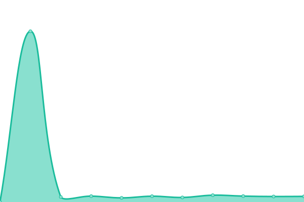

# [📈 Live Status](https://IDR.github.io/upptime): <!--live status--> **🟧 Partial outage**

This repository contains the open-source uptime monitor and status page for [Image Data Resource](https://idr.openmicroscopy.org), powered by [Upptime](https://github.com/upptime/upptime).

With [Upptime](https://upptime.js.org), you can get your own unlimited and free uptime monitor and status page, powered entirely by a GitHub repository. We use [Issues](https://github.com/IDR/upptime/issues) as incident reports, [Actions](https://github.com/IDR/upptime/actions) as uptime monitors, and [Pages](https://IDR.github.io/upptime) for the status page.

<!--start: status pages-->
<!-- This summary is generated by Upptime (https://github.com/upptime/upptime) -->
<!-- Do not edit this manually, your changes will be overwritten -->
<!-- prettier-ignore -->
| URL | Status | History | Response Time | Uptime |
| --- | ------ | ------- | ------------- | ------ |
|  [IDR](https://idr.openmicroscopy.org) | 🟥 Down | [idr.yml](https://github.com/IDR/upptime/commits/HEAD/history/idr.yml) | 

 572ms
     
 | 

<a href="https://IDR.github.io/upptime/history/idr">99.71%</a>
    

|  [IDR FTP](idr-ftp.openmicroscopy.org) | 🟩 Up | [idr-ftp.yml](https://github.com/IDR/upptime/commits/HEAD/history/idr-ftp.yml) | 

 117ms
     
 | 

<a href="https://IDR.github.io/upptime/history/idr-ftp">100.00%</a>
    

|  [ITR](https://itr.openmicroscopy.org) | 🟥 Down | [itr.yml](https://github.com/IDR/upptime/commits/HEAD/history/itr.yml) | 

 723ms
     
 | 

<a href="https://IDR.github.io/upptime/history/itr">99.79%</a>
    

|  [IDR API](https://idr.openmicroscopy.org/about/api.html) | 🟥 Down | [idr-api.yml](https://github.com/IDR/upptime/commits/HEAD/history/idr-api.yml) | 

 174ms
     
 | 

<a href="https://IDR.github.io/upptime/history/idr-api">99.80%</a>
    

|  [IDR submission](https://idr.openmicroscopy.org/about/submission.html) | 🟥 Down | [idr-submission.yml](https://github.com/IDR/upptime/commits/HEAD/history/idr-submission.yml) | 

 173ms
     
 | 

<a href="https://IDR.github.io/upptime/history/idr-submission">99.81%</a>
    

|  [IDR Analysis](https://idr-analysis.openmicroscopy.org) | 🟥 Down | [idr-analysis.yml](https://github.com/IDR/upptime/commits/HEAD/history/idr-analysis.yml) | 

 634ms
     
 | 

<a href="https://IDR.github.io/upptime/history/idr-analysis">99.81%</a>
    

|  [IDR Jupyter](https://idr.openmicroscopy.org/jupyter) | 🟥 Down | [idr-jupyter.yml](https://github.com/IDR/upptime/commits/HEAD/history/idr-jupyter.yml) | 

 174ms
     
 | 

<a href="https://IDR.github.io/upptime/history/idr-jupyter">99.82%</a>
    

|  [IDR (well 590686)](https://idr.openmicroscopy.org/webclient/?show=well-590686) | 🟥 Down | [idr-well-590686.yml](https://github.com/IDR/upptime/commits/HEAD/history/idr-well-590686.yml) | 

 474ms
     
 | 

<a href="https://IDR.github.io/upptime/history/idr-well-590686">99.76%</a>
    

|  [IDR (well 119093)](https://idr.openmicroscopy.org/webclient/?show=well-119093) | 🟥 Down | [idr-well-119093.yml](https://github.com/IDR/upptime/commits/HEAD/history/idr-well-119093.yml) | 

 328ms
     
 | 

<a href="https://IDR.github.io/upptime/history/idr-well-119093">99.78%</a>
    

|  [IDR (well 4852)](https://idr.openmicroscopy.org/webclient/?show=well-4852) | 🟥 Down | [idr-well-4852.yml](https://github.com/IDR/upptime/commits/HEAD/history/idr-well-4852.yml) | 

 304ms
     
 | 

<a href="https://IDR.github.io/upptime/history/idr-well-4852">99.78%</a>
    

|  [IDR (well 469267)](https://idr.openmicroscopy.org/webclient/?show=well-469267) | 🟥 Down | [idr-well-469267.yml](https://github.com/IDR/upptime/commits/HEAD/history/idr-well-469267.yml) | 

 304ms
     
 | 

<a href="https://IDR.github.io/upptime/history/idr-well-469267">99.79%</a>
    

|  [IDR (well 547609)](https://idr.openmicroscopy.org/webclient/?show=well-547609) | 🟥 Down | [idr-well-547609.yml](https://github.com/IDR/upptime/commits/HEAD/history/idr-well-547609.yml) | 

 312ms
     
 | 

<a href="https://IDR.github.io/upptime/history/idr-well-547609">99.79%</a>
    

|  [IDR (image 820684)](https://idr.openmicroscopy.org/webclient/?show=image-820684) | 🟥 Down | [idr-image-820684.yml](https://github.com/IDR/upptime/commits/HEAD/history/idr-image-820684.yml) | 

 350ms
     
 | 

<a href="https://IDR.github.io/upptime/history/idr-image-820684">99.85%</a>
    

|  [IDR (well 37472)](https://idr.openmicroscopy.org/webclient/?show=well-37472) | 🟥 Down | [idr-well-37472.yml](https://github.com/IDR/upptime/commits/HEAD/history/idr-well-37472.yml) | 

 304ms
     
 | 

<a href="https://IDR.github.io/upptime/history/idr-well-37472">99.85%</a>
    

|  [IDR (well 45407)](https://idr.openmicroscopy.org/webclient/?show=well-45407) | 🟥 Down | [idr-well-45407.yml](https://github.com/IDR/upptime/commits/HEAD/history/idr-well-45407.yml) | 

 302ms
     
 | 

<a href="https://IDR.github.io/upptime/history/idr-well-45407">99.86%</a>
    

|  [IDR (image 648950)](https://idr.openmicroscopy.org/webclient/?show=image-648950) | 🟥 Down | [idr-image-648950.yml](https://github.com/IDR/upptime/commits/HEAD/history/idr-image-648950.yml) | 

 352ms
     
 | 

<a href="https://IDR.github.io/upptime/history/idr-image-648950">99.86%</a>
    

|  [IDR (image 3063667)](https://idr.openmicroscopy.org/webclient/?show=image-3063667) | 🟥 Down | [idr-image-3063667.yml](https://github.com/IDR/upptime/commits/HEAD/history/idr-image-3063667.yml) | 

 342ms
     
 | 

<a href="https://IDR.github.io/upptime/history/idr-image-3063667">99.87%</a>
    

|  [IDR (image 2849866)](https://idr.openmicroscopy.org/webclient/?show=image-2849866) | 🟥 Down | [idr-image-2849866.yml](https://github.com/IDR/upptime/commits/HEAD/history/idr-image-2849866.yml) | 

 335ms
     
 | 

<a href="https://IDR.github.io/upptime/history/idr-image-2849866">99.87%</a>
    

|  [IDR (image 1821818)](https://idr.openmicroscopy.org/webclient/?show=image-1821818) | 🟥 Down | [idr-image-1821818.yml](https://github.com/IDR/upptime/commits/HEAD/history/idr-image-1821818.yml) | 

 350ms
     
 | 

<a href="https://IDR.github.io/upptime/history/idr-image-1821818">99.88%</a>
    

|  [IDR (image 1636543)](https://idr.openmicroscopy.org/webclient/?show=image-1636543) | 🟥 Down | [idr-image-1636543.yml](https://github.com/IDR/upptime/commits/HEAD/history/idr-image-1636543.yml) | 

 339ms
     
 | 

<a href="https://IDR.github.io/upptime/history/idr-image-1636543">99.88%</a>
    

|  [IDR (well 1056578)](https://idr.openmicroscopy.org/webclient/?show=well-1056578) | 🟥 Down | [idr-well-1056578.yml](https://github.com/IDR/upptime/commits/HEAD/history/idr-well-1056578.yml) | 

 301ms
     
 | 

<a href="https://IDR.github.io/upptime/history/idr-well-1056578">99.89%</a>
    

|  [IDR (well 1029401)](https://idr.openmicroscopy.org/webclient/?show=well-1029401) | 🟥 Down | [idr-well-1029401.yml](https://github.com/IDR/upptime/commits/HEAD/history/idr-well-1029401.yml) | 

 305ms
     
 | 

<a href="https://IDR.github.io/upptime/history/idr-well-1029401">99.89%</a>
    

|  [IDR (well 1046336)](https://idr.openmicroscopy.org/webclient/?show=well-1046336) | 🟥 Down | [idr-well-1046336.yml](https://github.com/IDR/upptime/commits/HEAD/history/idr-well-1046336.yml) | 

 309ms
     
 | 

<a href="https://IDR.github.io/upptime/history/idr-well-1046336">99.90%</a>
    

|  [IDR (dataset 369)](https://idr.openmicroscopy.org/webclient/?show=dataset-369) | 🟥 Down | [idr-dataset-369.yml](https://github.com/IDR/upptime/commits/HEAD/history/idr-dataset-369.yml) | 

 289ms
     
 | 

<a href="https://IDR.github.io/upptime/history/idr-dataset-369">99.90%</a>
    

|  [IDR (well 1024671)](https://idr.openmicroscopy.org/webclient/?show=well-1024671) | 🟥 Down | [idr-well-1024671.yml](https://github.com/IDR/upptime/commits/HEAD/history/idr-well-1024671.yml) | 

 314ms
     
 | 

<a href="https://IDR.github.io/upptime/history/idr-well-1024671">99.91%</a>
    

|  [IDR (well 1030579)](https://idr.openmicroscopy.org/webclient/?show=well-1030579) | 🟥 Down | [idr-well-1030579.yml](https://github.com/IDR/upptime/commits/HEAD/history/idr-well-1030579.yml) | 

 310ms
     
 | 

<a href="https://IDR.github.io/upptime/history/idr-well-1030579">99.91%</a>
    

|  [IDR (dataset 51)](https://idr.openmicroscopy.org/webclient/?show=dataset-51) | 🟥 Down | [idr-dataset-51.yml](https://github.com/IDR/upptime/commits/HEAD/history/idr-dataset-51.yml) | 

 285ms
     
 | 

<a href="https://IDR.github.io/upptime/history/idr-dataset-51">99.92%</a>
    

|  [IDR (dataset 61)](https://idr.openmicroscopy.org/webclient/?show=dataset-61) | 🟥 Down | [idr-dataset-61.yml](https://github.com/IDR/upptime/commits/HEAD/history/idr-dataset-61.yml) | 

 293ms
     
 | 

<a href="https://IDR.github.io/upptime/history/idr-dataset-61">99.92%</a>
    

|  [IDR 2858266](https://idr.openmicroscopy.org/webclient/?show=image-2858266) | 🟥 Down | [idr-2858266.yml](https://github.com/IDR/upptime/commits/HEAD/history/idr-2858266.yml) | 

 302ms
     
 | 

<a href="https://IDR.github.io/upptime/history/idr-2858266">99.93%</a>
    

|  [IDR (image 2895051)](https://idr.openmicroscopy.org/webclient/?show=image-2895051) | 🟥 Down | [idr-image-2895051.yml](https://github.com/IDR/upptime/commits/HEAD/history/idr-image-2895051.yml) | 

 372ms
     
 | 

<a href="https://IDR.github.io/upptime/history/idr-image-2895051">99.94%</a>
    

|  [IDR (image 3125776)](https://idr.openmicroscopy.org/webclient/?show=image-3125776) | 🟥 Down | [idr-image-3125776.yml](https://github.com/IDR/upptime/commits/HEAD/history/idr-image-3125776.yml) | 

 303ms
     
 | 

<a href="https://IDR.github.io/upptime/history/idr-image-3125776">99.94%</a>
    

|  [IDR (phenotype CMPO_0000393)](https://idr.openmicroscopy.org/mapr/phenotype/?value=CMPO_0000393) | 🟥 Down | [idr-phenotype-cmpo-0000393.yml](https://github.com/IDR/upptime/commits/HEAD/history/idr-phenotype-cmpo-0000393.yml) | 

 174ms
     
 | 

<a href="https://IDR.github.io/upptime/history/idr-phenotype-cmpo-0000393">99.95%</a>
    

|  [IDR (phenotype CMPO_0000118)](https://idr.openmicroscopy.org/mapr/phenotype/?value=CMPO_0000118) | 🟥 Down | [idr-phenotype-cmpo-0000118.yml](https://github.com/IDR/upptime/commits/HEAD/history/idr-phenotype-cmpo-0000118.yml) | 

 174ms
     
 | 

<a href="https://IDR.github.io/upptime/history/idr-phenotype-cmpo-0000118">99.95%</a>
    

|  [IDR (phenotype CMPO_0000140)](https://idr.openmicroscopy.org/mapr/phenotype/?value=CMPO_0000140) | 🟥 Down | [idr-phenotype-cmpo-0000140.yml](https://github.com/IDR/upptime/commits/HEAD/history/idr-phenotype-cmpo-0000140.yml) | 

 174ms
     
 | 

<a href="https://IDR.github.io/upptime/history/idr-phenotype-cmpo-0000140">99.96%</a>
    

|  [IDR (gene SGOL1)](https://idr.openmicroscopy.org/mapr/gene/?value=SGOL1) | 🟥 Down | [idr-gene-sgol-1.yml](https://github.com/IDR/upptime/commits/HEAD/history/idr-gene-sgol-1.yml) | 

 174ms
     
 | 

<a href="https://IDR.github.io/upptime/history/idr-gene-sgol-1">99.96%</a>
    

|  [IDR (gene Car4)](https://idr.openmicroscopy.org/mapr/gene/?value=Car4) | 🟥 Down | [idr-gene-car4.yml](https://github.com/IDR/upptime/commits/HEAD/history/idr-gene-car4.yml) | 

 174ms
     
 | 

<a href="https://IDR.github.io/upptime/history/idr-gene-car4">99.97%</a>
    

|  [IDR (dataset 153)](https://idr.openmicroscopy.org/webclient/?show=dataset-153) | 🟥 Down | [idr-dataset-153.yml](https://github.com/IDR/upptime/commits/HEAD/history/idr-dataset-153.yml) | 

 296ms
     
 | 

<a href="https://IDR.github.io/upptime/history/idr-dataset-153">99.97%</a>
    

|  [IDR (image 1918940)](https://idr.openmicroscopy.org/webclient/?show=image-1918940) | 🟥 Down | [idr-image-1918940.yml](https://github.com/IDR/upptime/commits/HEAD/history/idr-image-1918940.yml) | 

 303ms
     
 | 

<a href="https://IDR.github.io/upptime/history/idr-image-1918940">99.98%</a>
    

|  [IDR (image 1918953)](https://idr.openmicroscopy.org/webclient/?show=image-1918953) | 🟥 Down | [idr-image-1918953.yml](https://github.com/IDR/upptime/commits/HEAD/history/idr-image-1918953.yml) | 

 302ms
     
 | 

<a href="https://IDR.github.io/upptime/history/idr-image-1918953">99.98%</a>
    

|  [IDR (well 828419)](https://idr.openmicroscopy.org/webclient/?show=well-828419) | 🟥 Down | [idr-well-828419.yml](https://github.com/IDR/upptime/commits/HEAD/history/idr-well-828419.yml) | 

 305ms
     
 | 

<a href="https://IDR.github.io/upptime/history/idr-well-828419">99.99%</a>
    

|  [IDR (mineotaur)](https://idr.openmicroscopy.org/mineotaur/) | 🟥 Down | [idr-mineotaur.yml](https://github.com/IDR/upptime/commits/HEAD/history/idr-mineotaur.yml) | 

 174ms
     
 | 

<a href="https://IDR.github.io/upptime/history/idr-mineotaur">99.99%</a>
    

|  [IDR (well 592371)](https://idr.openmicroscopy.org/webclient/?show=well-592371) | 🟥 Down | [idr-well-592371.yml](https://github.com/IDR/upptime/commits/HEAD/history/idr-well-592371.yml) | 

 311ms
     
 | 

<a href="https://IDR.github.io/upptime/history/idr-well-592371">100.00%</a>
    

|  [IDR notebooks (GitHub)](https://github.com/IDR/idr-notebooks) | 🟩 Up | [idr-notebooks-git-hub.yml](https://github.com/IDR/upptime/commits/HEAD/history/idr-notebooks-git-hub.yml) | 

 370ms
     
 | 

<a href="https://IDR.github.io/upptime/history/idr-notebooks-git-hub">100.00%</a>
    

|  [IDR metadata (GitHub)](https://github.com/IDR/idr-metadata) | 🟩 Up | [idr-metadata-git-hub.yml](https://github.com/IDR/upptime/commits/HEAD/history/idr-metadata-git-hub.yml) | 

 323ms
     
 | 

<a href="https://IDR.github.io/upptime/history/idr-metadata-git-hub">100.00%</a>
    

|  IDR tracking system | 🟩 Up | [idr-tracking-system.yml](https://github.com/IDR/upptime/commits/HEAD/history/idr-tracking-system.yml) | 

 851ms
     
 | 

<a href="https://IDR.github.io/upptime/history/idr-tracking-system">100.00%</a>
    

<!--end: status pages-->

[**Visit our status website →**](https://IDR.github.io/upptime)

## 📄 License

- Powered by: [Upptime](https://github.com/upptime/upptime)
- Code: [MIT](./LICENSE) © [Image Data Resource](https://idr.openmicroscopy.org)
- Data in the `./history` directory: [Open Database License](https://opendatacommons.org/licenses/odbl/1-0/)
