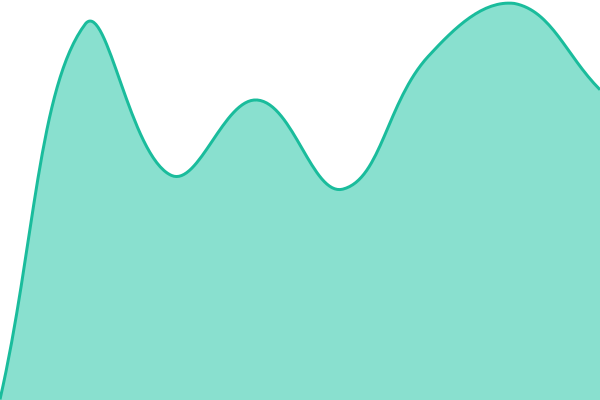
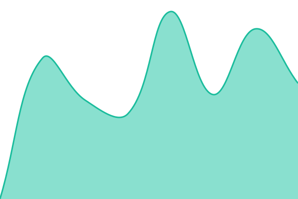

# [📈 Live Status](https://IDR.github.io/upptime): <!--live status--> **🟧 Partial outage**

This repository contains the open-source uptime monitor and status page for [Image Data Resource](https://idr.openmicroscopy.org), powered by [Upptime](https://github.com/upptime/upptime).

With [Upptime](https://upptime.js.org), you can get your own unlimited and free uptime monitor and status page, powered entirely by a GitHub repository. We use [Issues](https://github.com/IDR/upptime/issues) as incident reports, [Actions](https://github.com/IDR/upptime/actions) as uptime monitors, and [Pages](https://IDR.github.io/upptime) for the status page.

<!--start: status pages-->
<!-- This summary is generated by Upptime (https://github.com/upptime/upptime) -->
<!-- Do not edit this manually, your changes will be overwritten -->
<!-- prettier-ignore -->
| URL | Status | History | Response Time | Uptime |
| --- | ------ | ------- | ------------- | ------ |
|  [IDR](https://idr.openmicroscopy.org) | 🟩 Up | [idr.yml](https://github.com/IDR/upptime/commits/HEAD/history/idr.yml) | 

 721ms
     
 | 

<a href="https://IDR.github.io/upptime/history/idr">100.00%</a>
    

|  [ITR](https://itr.openmicroscopy.org) | 🟩 Up | [itr.yml](https://github.com/IDR/upptime/commits/HEAD/history/itr.yml) | 

 1123ms
     
 | 

<a href="https://IDR.github.io/upptime/history/itr">100.00%</a>
    

|  [IDR API](https://idr.openmicroscopy.org/about/api.html) | 🟩 Up | [idr-api.yml](https://github.com/IDR/upptime/commits/HEAD/history/idr-api.yml) | 

 537ms
     
 | 

<a href="https://IDR.github.io/upptime/history/idr-api">100.00%</a>
    

|  [IDR submission](https://idr.openmicroscopy.org/about/submission.html) | 🟩 Up | [idr-submission.yml](https://github.com/IDR/upptime/commits/HEAD/history/idr-submission.yml) | 

 561ms
     
 | 

<a href="https://IDR.github.io/upptime/history/idr-submission">100.00%</a>
    

|  [IDR Analysis](https://idr-analysis.openmicroscopy.org) | 🟩 Up | [idr-analysis.yml](https://github.com/IDR/upptime/commits/HEAD/history/idr-analysis.yml) | 

 1026ms
     
 | 

<a href="https://IDR.github.io/upptime/history/idr-analysis">100.00%</a>
    

|  [IDR Jupyter](https://idr.openmicroscopy.org/jupyter) | 🟩 Up | [idr-jupyter.yml](https://github.com/IDR/upptime/commits/HEAD/history/idr-jupyter.yml) | 

 815ms
     
 | 

<a href="https://IDR.github.io/upptime/history/idr-jupyter">100.00%</a>
    

|  [IDR (well 590686)](https://idr.openmicroscopy.org/webclient/?show=well-590686) | 🟩 Up | [idr-well-590686.yml](https://github.com/IDR/upptime/commits/HEAD/history/idr-well-590686.yml) | 

 1028ms
     
 | 

<a href="https://IDR.github.io/upptime/history/idr-well-590686">100.00%</a>
    

|  [IDR (well 119093)](https://idr.openmicroscopy.org/webclient/?show=well-119093) | 🟩 Up | [idr-well-119093.yml](https://github.com/IDR/upptime/commits/HEAD/history/idr-well-119093.yml) | 

 972ms
     
 | 

<a href="https://IDR.github.io/upptime/history/idr-well-119093">100.00%</a>
    

|  [IDR (image 648950)](https://idr.openmicroscopy.org/webclient/?show=image-648950) | 🟩 Up | [idr-image-648950.yml](https://github.com/IDR/upptime/commits/HEAD/history/idr-image-648950.yml) | 

 1075ms
     
 | 

<a href="https://IDR.github.io/upptime/history/idr-image-648950">100.00%</a>
    

|  [IDR (dataset 61)](https://idr.openmicroscopy.org/webclient/?show=dataset-61) | 🟩 Up | [idr-dataset-61.yml](https://github.com/IDR/upptime/commits/HEAD/history/idr-dataset-61.yml) | 

 972ms
     
 | 

<a href="https://IDR.github.io/upptime/history/idr-dataset-61">100.00%</a>
    

|  [IDR (phenotype CMPO_0000393)](https://idr.openmicroscopy.org/mapr/phenotype/?value=CMPO_0000393) | 🟩 Up | [idr-phenotype-cmpo-0000393.yml](https://github.com/IDR/upptime/commits/HEAD/history/idr-phenotype-cmpo-0000393.yml) | 

 1088ms
     
 | 

<a href="https://IDR.github.io/upptime/history/idr-phenotype-cmpo-0000393">100.00%</a>
    

|  [IDR (gene SGOL1)](https://idr.openmicroscopy.org/mapr/gene/?value=SGOL1) | 🟩 Up | [idr-gene-sgol-1.yml](https://github.com/IDR/upptime/commits/HEAD/history/idr-gene-sgol-1.yml) | 

 1086ms
     
 | 

<a href="https://IDR.github.io/upptime/history/idr-gene-sgol-1">100.00%</a>
    

|  idr0054 sample image | 🟥 Down | [idr0054-sample-image.yml](https://github.com/IDR/upptime/commits/HEAD/history/idr0054-sample-image.yml) | 

 429ms
     
 | 

<a href="https://IDR.github.io/upptime/history/idr0054-sample-image">100.00%</a>
    

|  [IDR OME-NGFF sample plate](https://uk1s3.embassy.ebi.ac.uk/idr/zarr/v0.4/idr0001A/2551.zarr/.zattrs) | 🟩 Up | [idr-ome-ngff-sample-plate.yml](https://github.com/IDR/upptime/commits/HEAD/history/idr-ome-ngff-sample-plate.yml) | 

 938ms
     
 | 

<a href="https://IDR.github.io/upptime/history/idr-ome-ngff-sample-plate">100.00%</a>
    

|  IDR tracking system | 🟩 Up | [idr-tracking-system.yml](https://github.com/IDR/upptime/commits/HEAD/history/idr-tracking-system.yml) | 

 955ms
     
 | 

<a href="https://IDR.github.io/upptime/history/idr-tracking-system">100.00%</a>
    

<!--end: status pages-->

[**Visit our status website →**](https://IDR.github.io/upptime)

## 📄 License

- Powered by: [Upptime](https://github.com/upptime/upptime)
- Code: [MIT](./LICENSE) © [Image Data Resource](https://idr.openmicroscopy.org)
- Data in the `./history` directory: [Open Database License](https://opendatacommons.org/licenses/odbl/1-0/)
